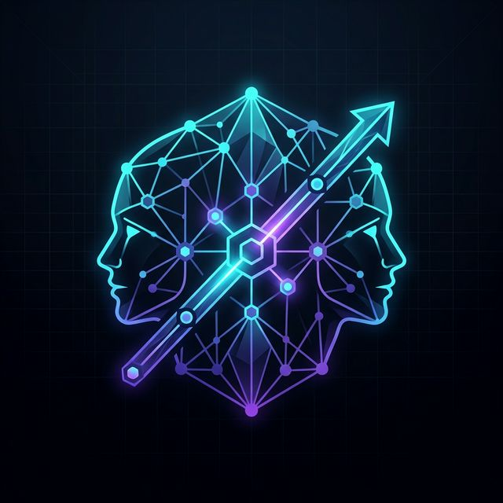
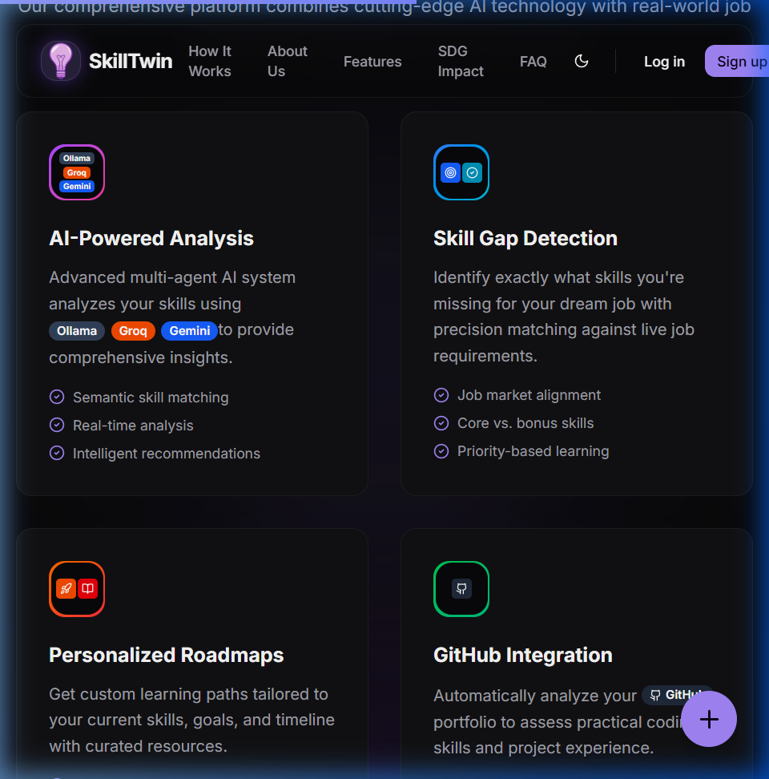

<div align="center">
  
  <h1>🔥 SkillTwin</h1>
  <p><b>AI-Powered Career Intelligence Platform — Turning Degrees into Job-Ready Skills</b></p>

  [](https://nextjs.org/)
  [](https://supabase.com/)
  [](https://tailwindcss.com/)
  [](https://www.framer.com/motion/)
</div>

---

## 🚀 What is SkillTwin?

**SkillTwin** is an AI-first career navigator that bridges the gap between **what students learn** and **what companies actually hire for**. By analyzing your resume and GitHub activity, it builds a **digital Skill Twin** to identify critical gaps and generate a personalized, week-by-week roadmap to employability.

<div align="center">
  
</div>

---

## 🚨 The Problem

Traditional education certifies **completion**, but the industry demands **capability**. 
- Graduates often have degrees but lack **employable skills**.
- Curriculums update in **years**, while technology changes in **months**.
- Students are often lost without a **clear path** to their target roles.

> **SkillTwin connects the dots through intelligence, not just information.**

---

## ✨ Key Features

### 🔍 AI Skill Gap Analysis
Upload your resume (PDF) or enter skills manually. SkillTwin extracts and compares your profile against **real industry benchmarks** for your target roles using **Google Gemini** and **Groq (Llama-3 70B)**.

### 🗺️ Personalized Learning Roadmaps
Don't just learn — learn *what matters*. Get an actionable **8–12 week learning plan** focused on outcomes, including curated resources and projects.

### 🐙 Developer Profile Intelligence (GitHub API)
We go beyond self-reported skills. By analyzing your **repository quality, commit history, and activity**, we build a true picture of your practical coding capabilities.

### 💬 Real-Time Social Proof
Built with **Supabase Realtime**, users can post reviews and feedback that appear instantly on the platform, fostering a community of growth.

### 💼 Live Job Matching
Dynamically fetched job listings via **RapidAPI**, intelligently matched to your **current and upcoming skills**.

---

## 🛠️ Tech Stack

| Category | Technology |
| --- | --- |
| **Frontend** | Next.js 16 (App Router), TypeScript, Tailwind CSS, Framer Motion |
| **Backend** | Supabase (PostgreSQL, Auth, Realtime, Storage) |
| **AI Processing** | Groq Cloud (Llama-3 70B), Google Gemini 1.5 Pro, Ollama |
| **Integrations** | GitHub API, RapidAPI (Job Search), Resend (Email) |

---

## 🚀 Getting Started

### Prerequisites
- Node.js **v18+**
- npm / pnpm / yarn
- API Keys: Supabase, Groq, Gemini, RapidAPI

### Installation

1. **Clone the repo**
   ```bash
   git clone https://github.com/ayushkumarjena15/Skill_Twin.git
   cd Skill_Twin
   ```

2. **Install dependencies**
   ```bash
   npm install
   ```

3. **Set up Environment Variables**
   Create a `.env.local` file and add your credentials:
   ```env
   NEXT_PUBLIC_SUPABASE_URL=your_url
   NEXT_PUBLIC_SUPABASE_ANON_KEY=your_key
   GROQ_API_KEY=your_key
   GEMINI_API_KEY=your_key
   ```

4. **Launch Development Server**
   ```bash
   npm run dev
   ```

---

## 🎨 Design Philosophy
SkillTwin is built with a **Premium UI/UX** focus:
- **Glassmorphism Design**: Modern, translucent interfaces.
- **Micro-Animations**: Seamless transitions with Framer Motion.
- **High-Impact Visuals**: Aurora backgrounds and particle effects.

---

## 🤝 Contributing
Contributions are what make the open source community such an amazing place to learn, inspire, and create. Any contributions you make are **greatly appreciated**.

1. Fork the Project
2. Create your Feature Branch (`git checkout -b feature/AmazingFeature`)
3. Commit your Changes (`git commit -m 'Add some AmazingFeature'`)
4. Push to the Branch (`git push origin feature/AmazingFeature`)
5. Open a Pull Request

---

<div align="center">
  <p>Built with ❤️ by <b>Team Liquid</b></p>
  <a href="https://github.com/ayushkumarjena15/Skill_Twin">
    
  </a>
</div>